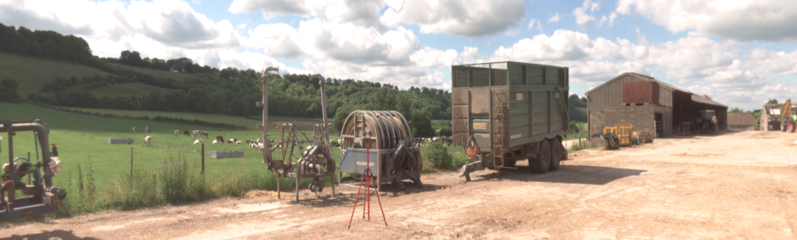
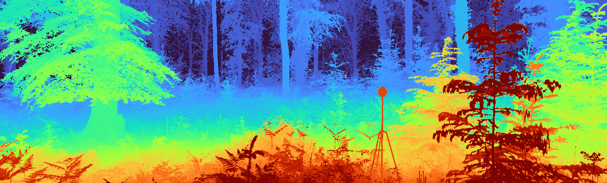
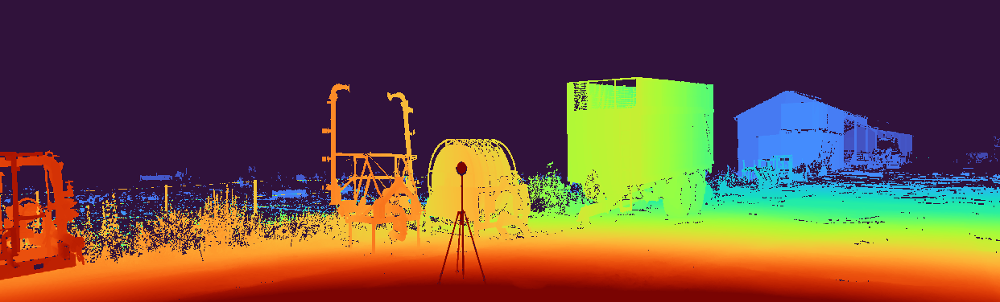
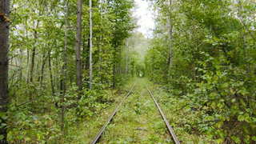
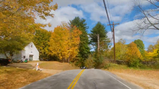
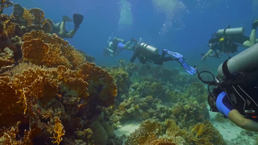
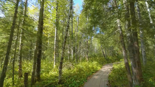
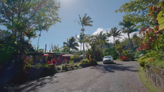
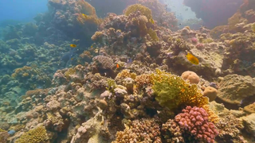

# Kick Back & Relax: Learning to Reconstruct the World by Watching SlowTV

---


This repository contains the code associated with the following publications:

> **Kick Back & Relax: Learning to Reconstruct the World by Watching SlowTV**
>
> [Jaime Spencer](https://www.surrey.ac.uk/people/jaime-spencer-martin), 
> [Chris Russell](https://www.amazon.science/author/chris-russell), 
> [Simon Hadfield](http://personal.ee.surrey.ac.uk/Personal/S.Hadfield) 
> and 
> [Richard Bowden](http://personal.ee.surrey.ac.uk/Personal/R.Bowden/)
>
> [ArXiv](https://arxiv.org/abs/2307.10713) (ICCV 2023)

> **Deconstructing Self-Supervised Monocular Reconstruction: The Design Decisions that Matter**
>
> [Jaime Spencer](https://www.surrey.ac.uk/people/jaime-spencer-martin), 
> [Chris Russell](https://www.amazon.science/author/chris-russell), 
> [Simon Hadfield](http://personal.ee.surrey.ac.uk/Personal/S.Hadfield) 
> and 
> [Richard Bowden](http://personal.ee.surrey.ac.uk/Personal/R.Bowden/)
>
> [ArXiv](https://arxiv.org/abs/2208.01489) (TMLR 2022)

> We have organized several monocular depth prediction challenges around the proposed SYNS-Patches dataset.
> Check the [MDEC](https://jspenmar.github.io/MDEC/) website for details on previous editions! 

<p align="center">



 



</p>

<p align="center">



 



</p>

---

## Project Structure
- [`.git-hooks`](./.git-hooks): Dir containing a pre-commit hook for ignoring Jupyter Notebook outputs.
- [`api`](./api): Dir containing main scripts for training, evaluating and data preparation.
- [`assets`](./assets) Dir containing images used in README. 
- [`cfg`](./cfg) Dir containing config files for training/evaluating.
- [`docker`](./docker) Dir containing Dockerfile and Anaconda package requirements.
- [`data`](./data)*: (Optional) Dir containing datasets.
- [`hpc`](./hpc): (Optional) Dir containing submission files to HPC clusters.
- [`models`](./models)*: (Optional) Dir containing trained model checkpoints.  
- [`results`](./results)*: Dir containing the precomputed results used in the paper.
- [`src`](./src): Dir containing source code.
- [`.gitignore`](./.gitignore): File containing patterns ignored by Git.
- [`PATHS.yaml`](./PATHS.yaml)*: File containing additional data & model roots.
- [`README.md`](./README.md): This file!

`*` Not tracked by Git!

---

## Pretrained Checkpoints

You can download the pretrained full model from the following DropBox link:

* KBR: https://www.dropbox.com/s/o8j4wyhnhgvh4o7/kbr.ckpt?dl=0

We also provide a [minium-requirements script](./api/quickstart/run.py) to load a pretrained model and 
compute predictions on a directory of images. 
This is probably what you want if you just want to try out the model, as opposed to training it yourself.
Code illustrating how to align the predictions to a ground-truth depth map can be found [here](./api/quickstart/align.py).

The only requirements for running the model are: `timm`, `torch` and `numpy`

---

## MapFreeReloc

You can download the val/test MapFreeReloc predictions for our public model from:

* KBR: https://www.dropbox.com/scl/fi/xy95m4xl5qlqvu6bpn9ba/mapfree_kbr_depth.tar.gz?rlkey=tjg8xbgsowd9fbkvw7uusg53m&dl=0

These can be used in your own MapFreeReloc submission to replace the baseline DPT+KITTI.
Please remember to [cite us](#citation) if doing so!

---

## Getting Started

Each section of the code has its own README file with more detailed instructions.
Follow them only after having carried out the remaining steps in this section.

- [Datasets](./api/data/README.md)
- [Evaluating](./api/eval/README.md)
- [MapFreeReloc](./api/mapfree/README.md)
- [Training](./api/train/README.md)
- [Source Code](./src/README.md)

### PYTHONPATH
Remember to add the path to the repo to the `PYTHONPATH` in order to run the code.
```shell
# Example for `bash`. Can be added to `~/.bashrc`.
export PYTHONPATH=/path/to/slowtv_monodepth:$PYTHONPATH
```

### Git Hooks
First, set up a GitHub pre-commit hook that stops us from committing [Jupyter Notebooks](https://jupyter.org) with outputs, 
since they may potentially contain large images.
```shell
./.git-hooks/setup.sh
chmod +x .git/hooks/pre-commit  # File sometimes isn't copied as executable. This should fix it. 
```

### Anaconda
If using [Miniconda](https://docs.conda.io/en/latest/miniconda.html), create the environment and run commands as
```shell
ENV_NAME=slowtv
conda env create --file docker/environment.yml
conda activate $ENV_NAME
python api/train/train.py ...
```

### Docker
To instead build the [Docker](https://www.docker.com) image, run
```shell
docker build -t $ENV_NAME ./docker
docker run -it \
    --shm-size=24gb \
    --gpus all \
    -v $(pwd -P):$(pwd -P) \
    -v /path/to/dataroot1:/path/to/dataroot1 \
    --user $(id -u):$(id -g) \
    $ENV_NAME:latest \
    /bin/bash

python api/train/train.py ...
```

### Paths
The default locations for datasets and model checkpoints are `./data` & `./models`, respectively.
If you want to store them somewhere else, you can either create [symlinks]( https://man7.org/linux/man-pages/man2/symlink.2.html) to them, or add additional roots.
This is done by creating the `./PATHS.yaml` file with the following contents:

```yaml
# -----------------------------------------------------------------------------
MODEL_ROOTS: 
  - /path/to/modelroot1

DATA_ROOTS:
  - /path/to/dataroot1
  - /path/to/dataroot2
  - /path/to/dataroot3
# -----------------------------------------------------------------------------
```

> **NOTE:** This file should not be tracked by Git, as it may contain sensitve information about your machine. 

Multiple roots may be useful if training in an HPC cluster where data has to be copied locally.
Roots should be listed in order of preference, i.e. `dataroot1/kitti_raw_syns` will be given preference over `dataroot2/kitti_raw_syns`.

### Results

We provide the YAML files containing the precomputed results used in the paper. 
These should be copied over to the `./models` directory (or any desired root) in order to follow the structure required 
by the evaluation and table-generating scripts. 

```shell
cp -r ./results/* ./models
```

---
  
## Citation
If you used the code in this repository or found the papers interesting, please cite them as
```text
@inproceedings{spencer2023slowtv,
title={Kick Back & Relax: Learning to Reconstruct the World by Watching SlowTV},
author={Jaime Spencer and Chris Russell and Simon Hadfield and Richard Bowden},
booktitle={Proceedings of the IEEE/CVF International Conference on Computer Vision},
year={2023}
}
```

```text
@article{spencer2022deconstructing,
title={Deconstructing Self-Supervised Monocular Reconstruction: The Design Decisions that Matter},
author={Jaime Spencer and Chris Russell and Simon Hadfield and Richard Bowden},
journal={Transactions on Machine Learning Research},
issn={2835-8856},
year={2022},
url={https://openreview.net/forum?id=GFK1FheE7F},
note={Reproducibility Certification}
}
```

---
  
## References
We would also like to thank the authors of the papers below for their contributions and for releasing their code. 
Please consider citing them in your own work.

| Tag           | Title                                                                                                    | Author              | Conf      | ArXiv                                                                                                             | GitHub                                                               |
|---------------|----------------------------------------------------------------------------------------------------------|---------------------|-----------|-------------------------------------------------------------------------------------------------------------------|----------------------------------------------------------------------|
| Garg          | Unsupervised CNN for Single View Depth Estimation: Geometry to the Rescue                                | Garg et. al         | ECCV 2016 | [ArXiv](https://arxiv.org/abs/1603.04992)                                                                         | [GitHub](https://github.com/Ravi-Garg/Unsupervised_Depth_Estimation) |
| Monodepth     | Unsupervised Monocular Depth Estimation with Left-Right Consistency                                      | Godard et. al       | CVPR 2017 | [ArXiv](https://arxiv.org/abs/1609.03677)                                                                         | [GitHub](https://github.com/mrharicot/monodepth)                     |
| Kuznietsov    | Semi-Supervised Deep Learning for Monocular Depth Map Prediction                                         | Kuznietsov et. al   | CVPR 2017 | [ArXiv](https://arxiv.org/abs/1702.02706)                                                                         | [GitHub](https://github.com/Yevkuzn/semodepth)                       |
| SfM-Learner   | Unsupervised Learning of Depth and Ego-Motion from Video                                                 | Zhou et. al         | CVPR 2017 | [ArXiv](https://arxiv.org/abs/1704.07813)                                                                         | [GitHub](https://github.com/tinghuiz/SfMLearner)                     |
| Depth-VO-Feat | Unsupervised Learning of Monocular Depth Estimation and Visual Odometry with Deep Feature Reconstruction | Zhan et. al         | CVPR 2018 | [ArXiv](https://arxiv.org/abs/1803.03893)                                                                         | [GitHub](https://github.com/Huangying-Zhan/Depth-VO-Feat)            |
| DVSO          | Deep Virtual Stereo Odometry: Leveraging Deep Depth Prediction for Monocular Direct Sparse Odometry      | Yang et. al         | ECCV 2018 | [ArXiv](https://arxiv.org/abs/1807.02570)                                                                         |                                                                      |
| Klodt         | Supervising the new with the old: learning SFM from SFM                                                  | Klodt & Vedaldi     | ECCV 2018 | [CVF](https://openaccess.thecvf.com/content_ECCV_2018/papers/Maria_Klodt_Supervising_the_new_ECCV_2018_paper.pdf) |                                                                      |
| MonoResMatch  | Learning monocular depth estimation infusing traditional stereo knowledge                                | Tosi et. al         | CVPR 2019 | [ArXiv](https://arxiv.org/abs/1904.04144)                                                                         | [GitHub](https://github.com/fabiotosi92/monoResMatch-Tensorflow)     |
| DepthHints    | Self-Supervised Monocular Depth Hints                                                                    | Watson et. al       | ICCV 2019 | [ArXiv](https://arxiv.org/abs/1909.09051)                                                                         | [GitHub](https://github.com/nianticlabs/depth-hints)                 |
| Monodepth2    | Digging Into Self-Supervised Monocular Depth Estimation                                                  | Godard et. al       | ICCV 2019 | [ArXiv](https://arxiv.org/abs/1806.01260)                                                                         | [GitHub](https://github.com/nianticlabs/monodepth2)                  |
| SuperDepth    | SuperDepth: Self-Supervised, Super-Resolved Monocular Depth Estimation                                   | Pillai et. al       | ICRA 2019 | [ArXiv](https://arxiv.org/abs/1810.01849)                                                                         | [GitHub](https://github.com/ToyotaResearchInstitute/superdepth)      |
| Johnston      | Self-supervised Monocular Trained Depth Estimation using Self-attention and Discrete Disparity Volume    | Johnston & Carneiro | CVPR 2020 | [ArXiv](https://arxiv.org/abs/2003.13951)                                                                         |                                                                      |
| FeatDepth     | Feature-metric Loss for Self-supervised Learning of Depth and Egomotion                                  | Shu et. al          | ECCV 2020 | [ArXiv](https://arxiv.org/abs/2007.10603)                                                                         | [GitHub](https://github.com/sconlyshootery/FeatDepth)                |
| CADepth       | Channel-Wise Attention-Based Network for Self-Supervised Monocular Depth Estimation                      | Yan et. al          | 3DV 2021  | [ArXiv](https://arxiv.org/abs/2112.13047)                                                                         | [GitHub](https://github.com/kamiLight/CADepth-master)                |
| DiffNet       | Self-Supervised Monocular Depth Estimation with Internal Feature Fusion                                  | Zhou et. al         | BMVC 2021 | [ArXiv](https://arxiv.org/abs/2110.09482)                                                                         | [GitHub](https://github.com/brandleyzhou/DIFFNet)                    |
| HR-Depth      | HR-Depth: High Resolution Self-Supervised Monocular Depth Estimation                                     | Lyu et. al          | AAAI 2021  | [ArXiv](https://arxiv.org/abs/2012.07356)                                                                         | [GitHub](https://github.com/shawLyu/HR-Depth)                        |          
| MiDaS         | Towards Robust Monocular Depth Estimation: Mixing Datasets for Zero-shot Cross-dataset Transfer          | Ranftl el. al       | PAMI 2020 | [ArXiv](https://arxiv.org/abs/1907.01341v3)                                                                       | [GitHub](https://github.com/isl-org/MiDaS)                           |
| DPT           | Vision Transformers for Dense Prediction                                                                 | Ranftl el. al       | ICCV 2021 | [ArXiv](https://arxiv.org/abs/2103.13413)                                                                         | [GitHub](https://github.com/isl-org/DPT)                             |
| NeWCRFs       | NeW CRFs: Neural Window Fully-connected CRFs for Monocular Depth Estimation                              | Weihao el. al       | CVPR 2022 | [ArXiv](https://arxiv.org/abs/2203.01502)                                                                         | [GitHub](https://github.com/aliyun/NeWCRFs)                          |

---

## Licence
This project is licenced under the `Commons Clause` and `GNU GPL` licenses.
For commercial use, please contact the authors. 

---
